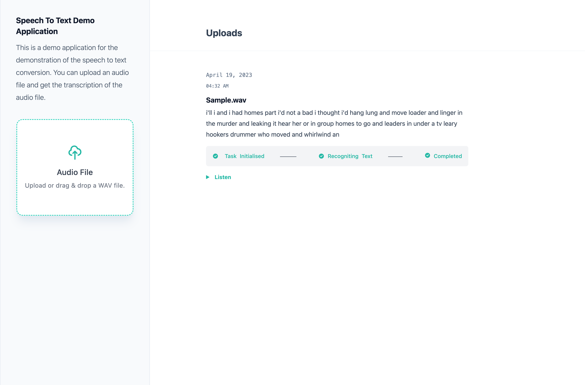
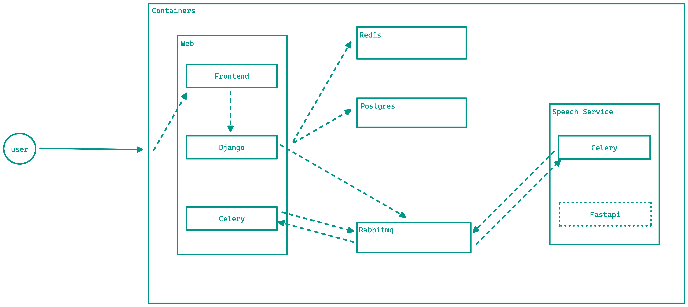

# Speech To Text Demo



This is a demo of the Speech To Text service. It a way to demonstrate how we could set a Speech To Text service would work in a microservice with a REST API. The demo has a front end that takes an audio file as input and sends it to the backend. The backend then sends the audio file to the Speech To Text service and returns the recognized text to the front end. The front end then displays the recognized text to the user.

**Note:** This repo is not intended to be used in a production environment. It is only intended to be used as a demo of the Speech To Text service. Also its under active development and is not stable.

Currently the demo has a single Speech To Text service that is used to recognize the text. Also a frontend that takes an audio file as input and displays the recognized text.

Plans for the future include:

- Make it production ready.
- Add a feature to add in new services to do a speech to text conversion. The frontend should have the ability to select which service to use.
- Compare different results from different services and display the best result.
- Support for multiple languages and multiple audio formats.
- Build api for the Speech To Text service to give a real-time response.
- Have a more streamlined way to maintaining and deploying the ML models.

## Overview

The demo is a simple command line application that takes a file as input and outputs the recognized text.

### Pre-requisites

- [Docker](https://docs.docker.com/engine/installation/)
- [Docker Compose](https://docs.docker.com/compose/install/)
- [Git](https://git-scm.com/book/en/v2/Getting-Started-Installing-Git)

## Getting Started

1. Clone the repository

   ```bash
   git clone https://github.com/Joel-hanson/speech-to-text-demo-application.git
   ```

1. Change directory to the project root

   ```bash
   cd speech-to-text-demo-application
   ```

1. Configure the environment variables

   ```bash
   cp .env.example .env
   ```

   Edit the `.env` file and set the environment variables.

1. Build and bring up the docker containers

   ```bash
   docker-compsoe up --build
   ```

1. Open a browser and go to [http://localhost:8000](http://localhost:8000)

1. Upload an audio file and click on the submit button.

**Note: The demo currently only supports .wav files.**

## Architecture



The demo is a simple command line application that takes a file as input and outputs the recognized text.

### Frontend

The frontend is a simple web application that takes an audio file as input and sends it to the backend. The backend then sends the audio file to the Speech To Text service and returns the recognized text to the front end. The front end then displays the recognized text to the user.

### Backend

The backend is a simple REST API that takes an audio file as input and sends it to the Speech To Text service. The backend then returns the recognized text to the front end.

### Speech To Text Service

The Speech To Text service is a simple REST API that takes an audio file as input and returns the recognized text.

### RabbitMQ

RabbitMQ is used as a message broker to send messages between the backend and the Speech To Text service.

### PostgreSQL

PostgreSQL is used as a database to store the audio files information and the recognized text.

### Redis

Redis is used as a cache.

## Faq

### Why do I see a TaskNotFound error when I try to upload an audio file?

This is because the Speech To Text service is not running or you might have updated the speech service and thus reloading the celery worker. To fix this, run the following command:

```bash
docker-compose restart
```

or save the task file in django and the celery worker will reload automatically.

### How is the frontend communicating with the backend?

The frontend is communicating with the backend using a REST API.

### What framework is the frontend using?

The frontend is using [React](https://reactjs.org/) run with [vite](https://vitejs.dev/).

### What framework is the backend using?

The backend is using [Django](https://www.djangoproject.com/).
